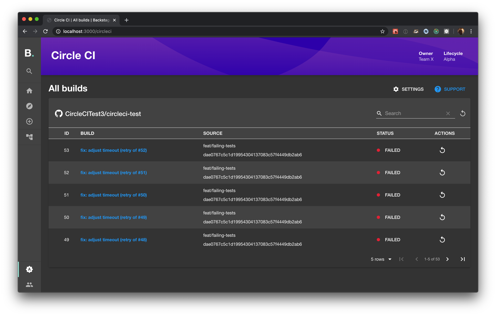
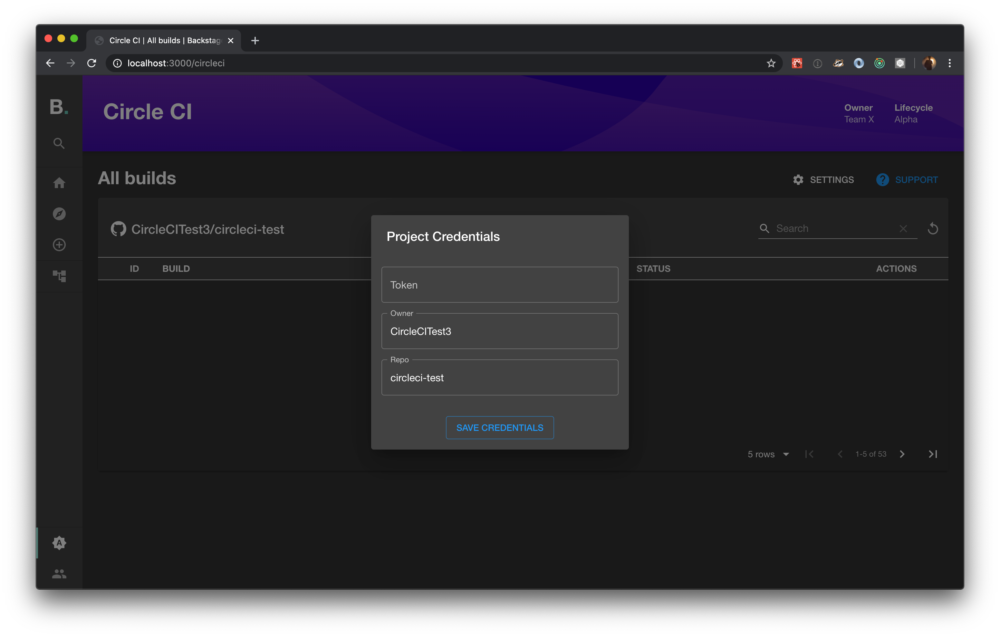
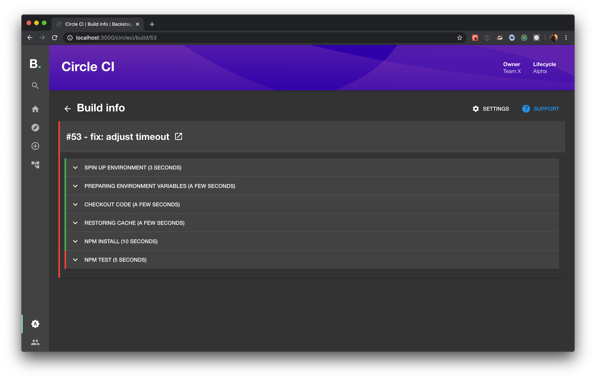
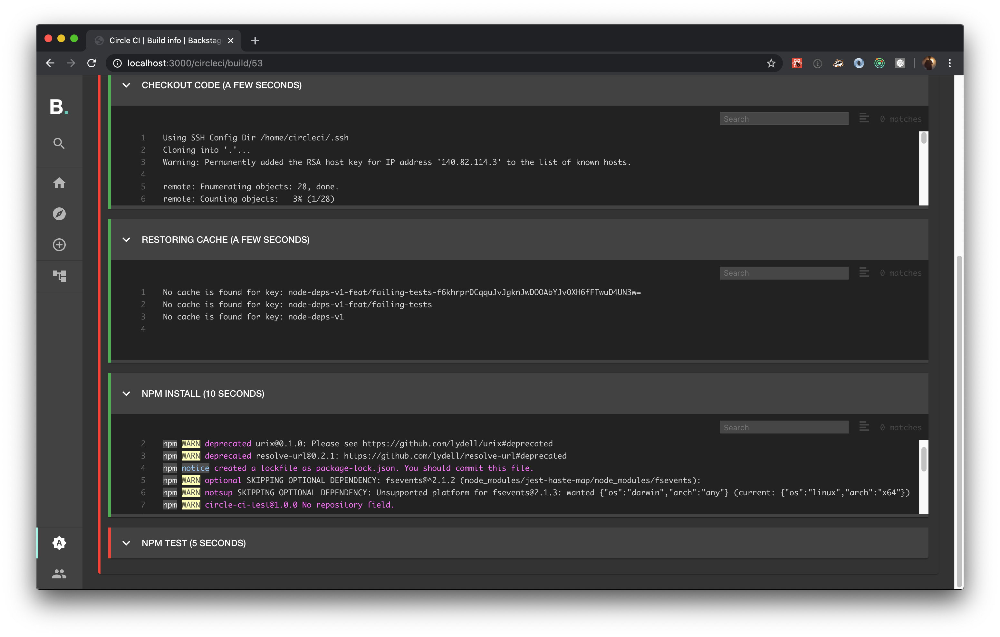

# CircleCI Plugin

Website: [https://www.jetbrains.com/teamcity/](https://www.jetbrains.com/teamcity/)






## Setup

0. If you have standalone app (you didn't clone this repo), then do

```bash
yarn add @backstage/plugin-teamcity
```

1. Add plugin API to your Backstage instance:

```js
// packages/app/src/api.ts
import { ApiHolder } from '@backstage/core';
import { TeamCityApi, teamCityApiRef } from '@backstage/plugin-teamcity';

const builder = ApiRegistry.builder();
builder.add(teamCityApiRef, new TeamCityApi(/* optional custom url for your own CircleCI instance */));

export default builder.build() as ApiHolder;
```

2. Add plugin itself:

```js
// packages/app/src/plugins.ts
export { plugin as Circleci } from '@backstage/plugin-teamcity';
```

3. Run app with `yarn start` and navigate to `/teamcity/settings`
4. Enter project settings and **project** token, acquired according to [https://circleci.com/docs/2.0/managing-api-tokens/](https://circleci.com/docs/2.0/managing-api-tokens/)

## Features

- List top 50 builds for a project
- Dive into one build to see logs
- Polling (logs only)
- Retry builds
- Works for both project and personal tokens
- Pagination for builds

## Limitations

- TeamCity has pretty strict rate limits per token, be careful with opened tabs
